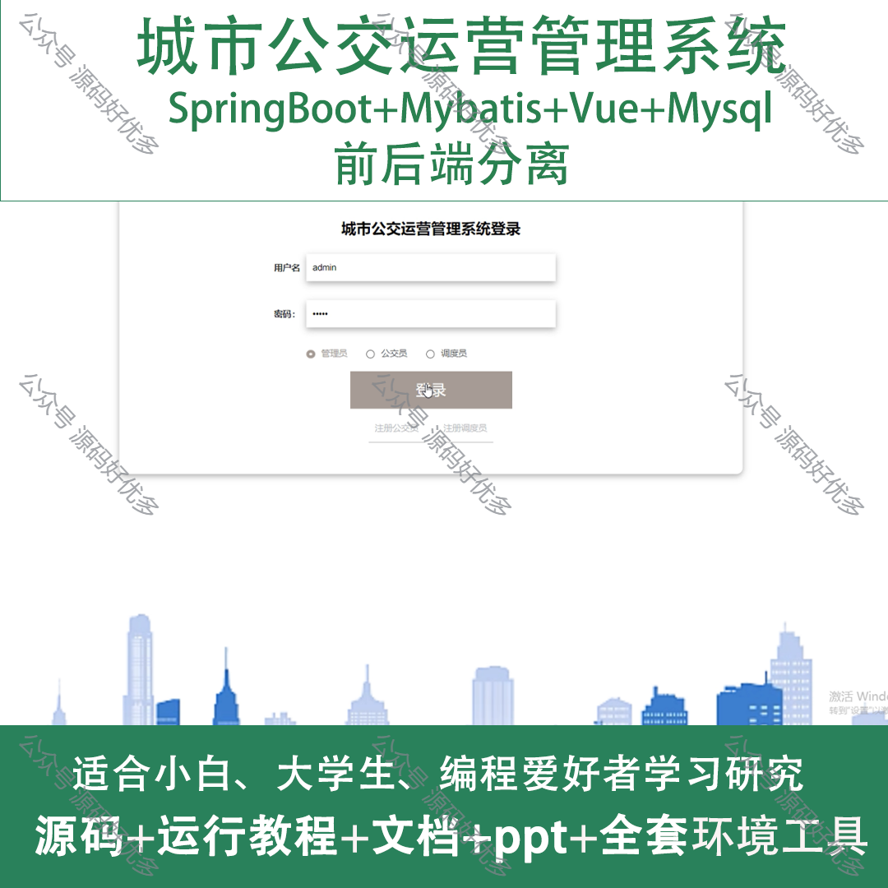
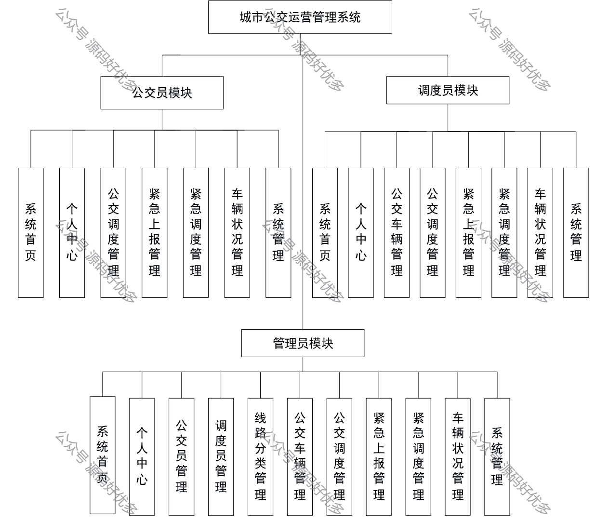
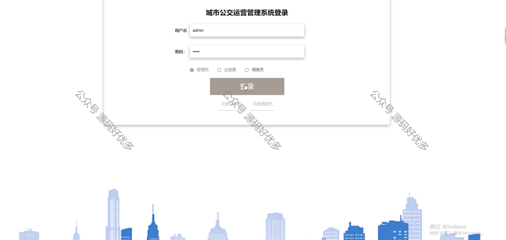
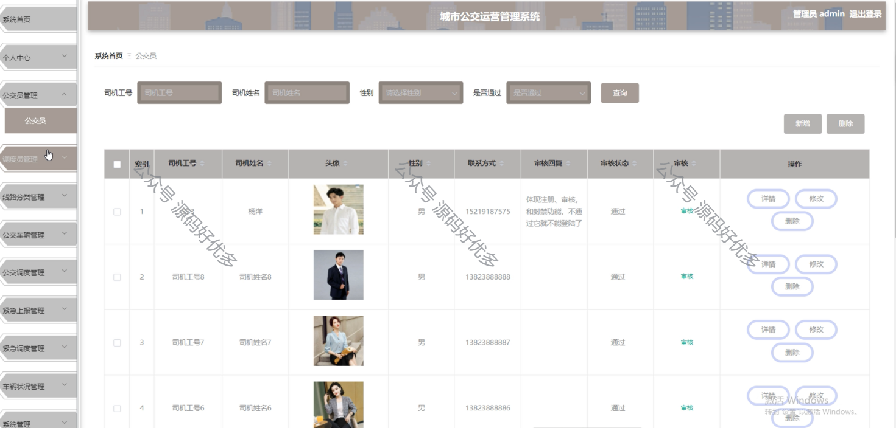
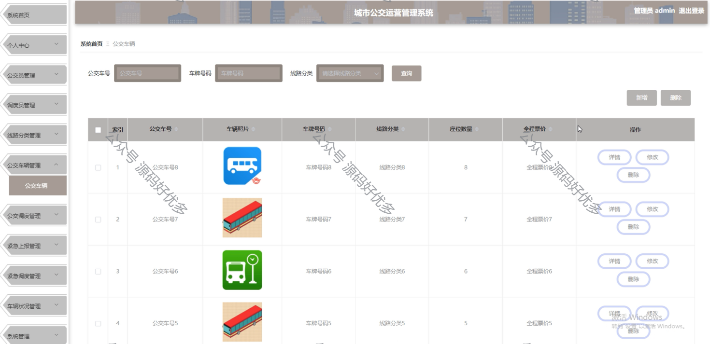
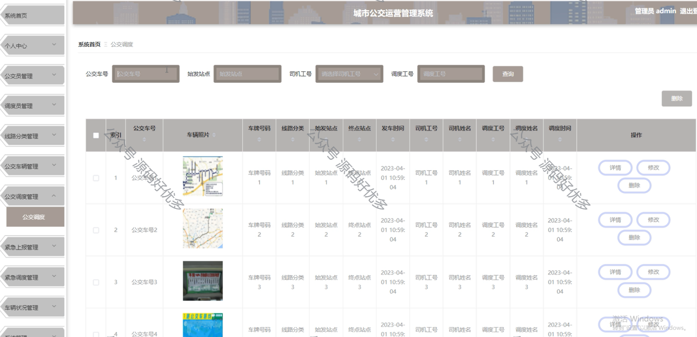
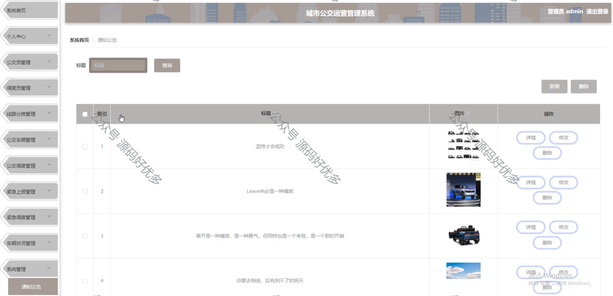
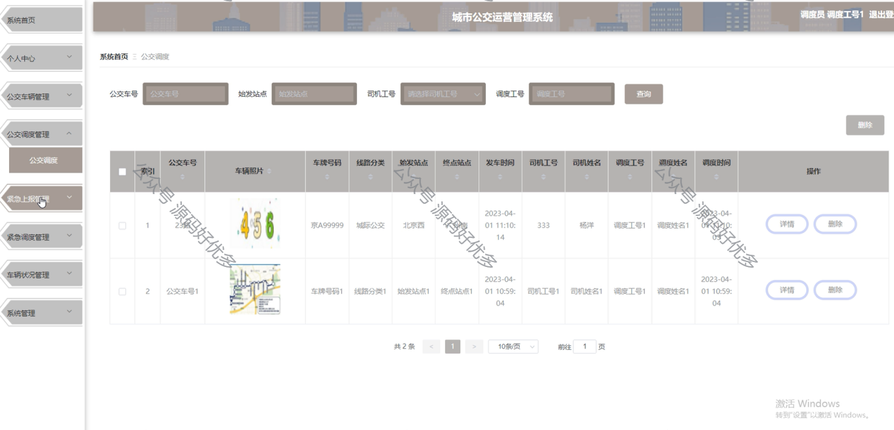
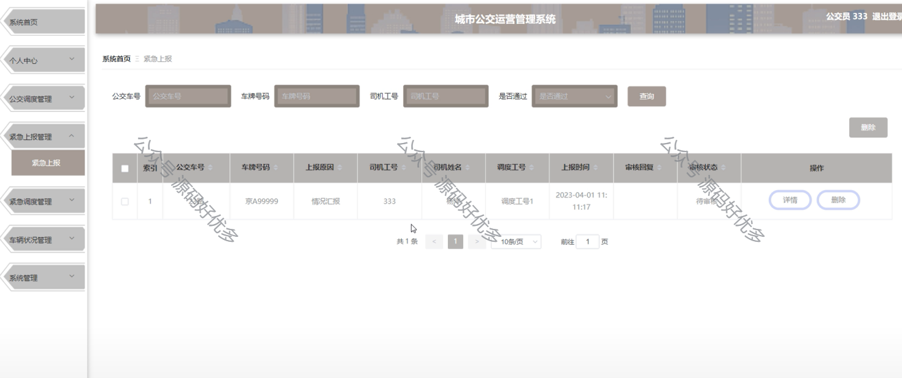
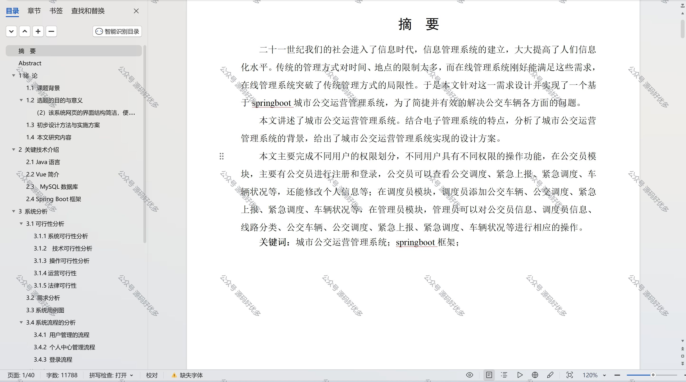

 
## 查看主页获取源码

> **作者介绍**： **✌**全网粉丝10W+本平台特邀作者、博客专家、CSDN新星计划导师、java领域优质创作者,博客之星、掘金/华为云/阿里云/InfoQ等平台优质作者、专注于项目实战 **✌**

  

### 一、作品包含

源码+数据库+设计文档万字+PPT+全套环境和工具资源+部署教程

### 二、项目技术

前端技术：Html、Css、Js、Vue、Element-ui

数据库：MySQL

后端技术：Java、Spring Boot、MyBatis

  

### 三、运行环境

开发工具：IDEA/eclipse

数据库：MySQL5.7

数据库管理工具：Navicat10以上版本

环境配置软件： JDK1.8+Maven3.6.3

前端Nodejs：14

### 四、项目介绍
项目编号：springbootA092

城市公交运营管理系统是为了提升公共交通服务质量、优化车辆调度、提高运营效率而设计的一套综合管理平台。该系统以现代信息技术为支撑，通过对公交线路、车辆、人员、运营数据进行实时监控和管理，确保公交系统的顺畅运行。

包括三个主要模块：公交员模块、调度员模块和管理员模块。

公交员模块包括个人中心、公交调度管理、紧急上报管理、紧急调度管理和车辆状况管理等功能。
调度员模块包括个人中心、公交车辆管理、公交调度管理、紧急上报管理、紧急调度管理和车辆状况管理等功能。
管理员模块包括系统首页、个人中心、公交员管理、调度员管理、线路分类管理、公交车辆管理、公交调度管理、紧急上报管理、紧急调度管理和车辆状况管理等功能。

### 五、运行截图

  
